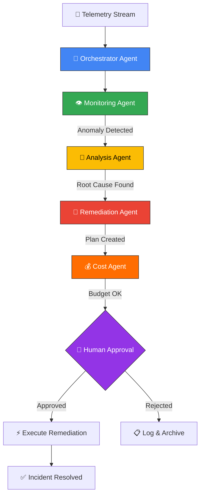

<div align="center">

# 🔥 PHOENIX SRE

### *AI-Powered Site Reliability Engineering Platform*

**Autonomous GPU Observability • Chaos Engineering • Self-Healing Infrastructure**

[](https://python.org)
[](https://nextjs.org)
[](https://fastapi.tiangolo.com)
[](https://ai.google.dev)
[](https://socket.io)
[](https://cloud.google.com)
[](LICENSE)
[](https://typescriptlang.org)

---

<br/>

> **Phoenix SRE** is an enterprise-grade, AI-driven Site Reliability Engineering platform that combines a **multi-agent AI orchestrator** with a **real-time GPU observability dashboard** and **chaos engineering toolkit** — all operating under a strict **$10 budget constraint**.

<br/>


</div>

---

## 📋 Table of Contents

- [✨ Key Features](#-key-features)
- [🏗️ System Architecture](#️-system-architecture)
- [🤖 Multi-Agent AI System](#-multi-agent-ai-system)
- [🧬 Dual-LLM Strategy](#-dual-llm-strategy)
- [🖥️ Dashboard Preview](#️-dashboard-preview)
- [📁 Project Structure](#-project-structure)
- [⚡ Quick Start](#-quick-start)
- [🔧 Configuration](#-configuration)
- [🌪️ Chaos Engineering](#️-chaos-engineering)
- [📡 Real-time WebSocket API](#-real-time-websocket-api)
- [🚢 Deployment](#-deployment)
- [🛤️ Roadmap](#️-roadmap)
- [📜 License](#-license)

---

## ✨ Key Features

<table>
<tr>
<td width="50%">

### 🤖 AI-Powered Agents
- **5-Agent Orchestration System** built on Google ADK patterns
- Real-time anomaly detection with adaptive thresholds
- **Gemini 2.0 Flash** powered root-cause analysis
- Autonomous remediation with human-in-the-loop approval

</td>
<td width="50%">

### 📊 Real-time Observability
- **200ms** metric streaming via WebSocket
- GPU utilization, latency, error rate, memory, queue depth
- Animated glassmorphism dashboard (Next.js 16 + Framer Motion)
- Live system health status with pulsing indicators

</td>
</tr>
<tr>
<td width="50%">

### 🌪️ Chaos Engineering
- 4 pre-built chaos scenarios (GPU Saturation, Latency Spike, Error Burst, Instance Crash)
- One-click trigger from the dashboard
- Real-time impact visualization
- Cost-aware scenario execution

</td>
<td width="50%">

### 💰 $10 Budget Constraint
- Real-time cost tracking per hour
- Budget exhaustion prediction
- Dual-LLM strategy saves **~80% on AI costs**
- Self-hosted Gemma for fast inference ($0/token)

</td>
</tr>
</table>

---

## 🏗️ System Architecture

```
┌────────────────────────────────────────────────────────────────────────────────┐
│                          PHOENIX SRE — SYSTEM ARCHITECTURE                    │
├────────────────────────────────────────────────────────────────────────────────┤
│                                                                                │
│  ┌─────────────────────────────────────────────────────┐                       │
│  │              🖥️  FRONTEND (Next.js 16)              │                       │
│  │                                                     │                       │
│  │  ┌───────────┐  ┌──────────┐  ┌───────────────┐    │                       │
│  │  │  Status    │  │  Chaos   │  │  AI Insights  │    │                       │
│  │  │  Banner    │  │  Cards   │  │  Panel        │    │                       │
│  │  └─────┬─────┘  └────┬─────┘  └───────┬───────┘    │                       │
│  │        │              │                │            │                       │
│  │  ┌─────┴──────────────┴────────────────┴──────┐     │                       │
│  │  │         useWebSocket() — Socket.IO         │     │                       │
│  │  └────────────────────┬───────────────────────┘     │                       │
│  └───────────────────────┼─────────────────────────────┘                       │
│                          │ WebSocket (200ms)                                   │
│                          ▼                                                     │
│  ┌─────────────────────────────────────────────────────┐                       │
│  │              ⚡ BACKEND (FastAPI + Socket.IO)        │                       │
│  │                                                     │                       │
│  │  ┌───────────────────────────────────────────┐      │                       │
│  │  │         🧠 ORCHESTRATOR AGENT             │      │                       │
│  │  │                                           │      │                       │
│  │  │  ┌──────────┐  ┌──────────┐  ┌────────┐  │      │                       │
│  │  │  │MONITORING│  │ ANALYSIS │  │REMEDIATE│  │      │                       │
│  │  │  │  Agent   │──│  Agent   │──│  Agent  │  │      │                       │
│  │  │  └──────────┘  └──────────┘  └────────┘  │      │                       │
│  │  │        │              │            │      │      │                       │
│  │  │        │         ┌────┴────┐       │      │      │                       │
│  │  │        │         │  COST   │       │      │      │                       │
│  │  │        │         │ Agent   │       │      │      │                       │
│  │  │        │         └─────────┘       │      │      │                       │
│  │  └────────┼──────────────────────────┼──────┘      │                       │
│  │           │                          │              │                       │
│  │  ┌────────┴───────┐    ┌────────────┴────────┐     │                       │
│  │  │ Metrics Engine │    │   Chaos Scenarios   │     │                       │
│  │  └────────────────┘    └─────────────────────┘     │                       │
│  └─────────────────────────────────────────────────────┘                       │
│                          │                                                     │
│           ┌──────────────┼──────────────┐                                      │
│           ▼              ▼              ▼                                      │
│  ┌──────────────┐ ┌────────────┐ ┌───────────────┐                            │
│  │ 🏔️ Gemma GPU │ │ 🌐 Gemini  │ │ ☁️  GCP       │                            │
│  │  (Ollama)    │ │  2.0 Flash │ │  Cloud Run    │                            │
│  │  Self-hosted │ │  API       │ │  Firestore    │                            │
│  │  $0/token    │ │  Deep RCA  │ │  Monitoring   │                            │
│  └──────────────┘ └────────────┘ └───────────────┘                            │
│                                                                                │
└────────────────────────────────────────────────────────────────────────────────┘
```

---

## 🤖 Multi-Agent AI System

Phoenix SRE uses a **5-agent orchestration architecture** inspired by Google's Agent Development Kit (ADK):



| Agent | Role | Technology |
|-------|------|------------|
| **🧠 Orchestrator** | Master coordinator — routes telemetry, manages incident lifecycle | Python async, event-driven |
| **👁️ Monitoring** | Real-time anomaly detection with adaptive thresholds | Statistical analysis, threshold rules |
| **🔬 Analysis** | Deep root-cause analysis using AI reasoning | Gemini 2.0 Flash / Rules fallback |
| **🔧 Remediation** | Auto-healing — scale, restart, optimize, clear cache | Async execution, rollback support |
| **💰 Cost Optimization** | Budget tracking, spend projection, savings recommendations | Per-action cost modeling |

### Incident Lifecycle

```
DETECTED → ANALYZED → PLAN_CREATED → AWAITING_APPROVAL → EXECUTING → RESOLVED
                                            │
                                            └──── REJECTED (logged)
```

---

## 🧬 Dual-LLM Strategy

Phoenix SRE implements an intelligent **hybrid AI routing** system that saves ~80% on AI costs:

```
┌──────────────────────────────────────────────────────────────┐
│                    INTELLIGENT LLM ROUTER                     │
├─────────────────────────────┬────────────────────────────────┤
│                             │                                │
│  🏔️  GEMMA (Self-Hosted)    │   🌐  GEMINI 2.0 Flash (API)  │
│                             │                                │
│  • Anomaly classification   │   • Root cause analysis        │
│  • Quick remediation tips   │   • Incident report generation │
│  • Log parsing              │   • Cost optimization strategy │
│  • Metric interpretation    │   • Predictive scaling ML      │
│  • Alert triage             │   • Complex troubleshooting    │
│  • Simple queries           │   • Strategic recommendations  │
│                             │                                │
│  Cost: $0.00/1M tokens      │   Cost: $0.25/1M tokens        │
│  Latency: ~50ms             │   Latency: ~500ms              │
│  Model: gemma3:270m         │   Model: gemini-2.0-flash-exp  │
└─────────────────────────────┴────────────────────────────────┘

           ↕ Smart routing based on task complexity
```

---

## 🖥️ Dashboard Preview

The frontend is a **premium enterprise-grade dashboard** built with:
- **Next.js 16** (Turbopack) for blazing-fast rendering
- **Framer Motion** for buttery-smooth animations
- **Glassmorphism** design system with custom CSS
- **Socket.IO** for 200ms real-time metric updates
- **Recharts** for data visualization

### Dashboard Pages

| Route | Description |
|-------|-------------|
| `/` | Main dashboard — status banner, GPU metrics, AI insights, chaos cards |
| `/chaos` | Chaos engineering scenario launcher |
| `/incidents` | Incident timeline and management |
| `/analysis` | AI-powered root cause analysis interface |
| `/costs` | Budget tracker and cost optimization |
| `/ai` | AI agent status and configuration |
| `/settings` | System configuration panel |

---

## 📁 Project Structure

```
Phoenix SRE/
│
├── 🖥️  frontend/                    # Next.js 16 Dashboard
│   ├── app/
│   │   ├── page.tsx                 # Main dashboard (real-time metrics)
│   │   ├── layout.tsx               # Root layout with providers
│   │   ├── globals.css              # Enterprise design system (glassmorphism)
│   │   ├── providers.tsx            # React Query + Theme providers
│   │   └── (dashboard)/             # Nested dashboard routes
│   │       ├── ai/                  #   └── AI agent interface
│   │       ├── analysis/            #   └── Root cause analysis
│   │       ├── chaos/               #   └── Chaos engineering panel
│   │       ├── costs/               #   └── Budget & cost tracking
│   │       ├── incidents/           #   └── Incident management
│   │       └── settings/            #   └── System configuration
│   ├── components/
│   │   ├── dashboard/
│   │   │   ├── StatusBanner.tsx      # Animated system status bar
│   │   │   ├── ChaosCard.tsx         # Chaos scenario trigger card
│   │   │   ├── ChaosScenarioCard.tsx # Enhanced scenario card
│   │   │   ├── MetricCard.tsx        # Real-time metric display
│   │   │   └── EnterpriseMetricCard.tsx  # Premium metric card
│   │   ├── ui/                       # Radix UI primitives (10 components)
│   │   ├── Sidebar.tsx               # Navigation sidebar
│   │   └── TopNav.tsx                # Top navigation bar
│   ├── hooks/
│   │   ├── useWebSocket.ts           # Socket.IO connection manager
│   │   ├── useRealtimeMetrics.ts     # Metric state management
│   │   └── useChaos.ts              # Chaos scenario trigger hook
│   └── lib/
│       └── utils.ts                  # Utility functions (cn, clsx)
│
├── ⚡ backend/                       # FastAPI + ADK Agents
│   ├── api/
│   │   ├── main.py                   # FastAPI app, CORS, Socket.IO setup
│   │   ├── websocket.py             # WebSocket server + metrics broadcaster
│   │   ├── chaos.py                  # Chaos engineering REST endpoints
│   │   └── incidents.py             # Incident management endpoints
│   ├── agents/
│   │   ├── orchestrator.py          # 🧠 Master coordinator agent
│   │   ├── monitoring.py            # 👁️ Anomaly detection agent
│   │   ├── analysis.py              # 🔬 Root cause analysis (Gemini AI)
│   │   ├── remediation.py           # 🔧 Auto-healing agent
│   │   └── cost.py                  # 💰 Cost optimization agent
│   ├── config/
│   │   ├── settings.py              # Pydantic settings (env-driven)
│   │   └── llm_config.py            # Dual-LLM routing configuration
│   └── requirements.txt             # Python dependencies
│
├── 🛠️  utils/                        # Shared utilities
│   ├── metrics_engine.py            # Time-series simulation engine
│   ├── chaos_scenarios.py           # Chaos scenario definitions
│   ├── ai_diagnosis.py              # AI-powered diagnosis utilities
│   ├── cost_calculator.py           # Cloud cost modeling
│   ├── cloud_run_api.py             # GCP Cloud Run integration
│   ├── firestore_logger.py          # Firestore event logging
│   └── pdf_generator.py             # Incident report PDF generation
│
├── 📜 scripts/                       # Automation scripts
│   ├── deploy-all.sh                # Master deployment (3-stage)
│   ├── deploy.sh                    # Cloud Run deployment
│   ├── quickstart.sh                # One-command local setup
│   └── setup-local-ai.py           # Ollama + Gemma local AI setup
│
├── 📖 docs/                          # Documentation
│   ├── ARCHITECTURE.md              # Deep-dive system architecture
│   ├── DEPLOYMENT.md                # Cloud deployment guide
│   ├── DEMO_SCRIPT.md              # Live demo walkthrough
│   ├── LOCAL_AI_SETUP.md           # Local Gemma/Ollama setup
│   ├── LOCAL_AI_INTEGRATION.md     # AI integration patterns
│   └── UI_IMPROVEMENTS.md          # UI/UX enhancement log
│
├── 🐳 Dockerfile                     # Multi-stage Docker build
├── 🐳 ollama-backend/Dockerfile     # Ollama GPU container
├── ☁️  cloudbuild.yaml               # GCP Cloud Build CI/CD
├── 🏗️  terraform/                    # Infrastructure as Code (GCP)
├── .env.example                     # Environment variable template
└── LICENSE                          # MIT License
```

---

## ⚡ Quick Start

### Prerequisites

| Tool | Version | Purpose |
|------|---------|---------|
| **Node.js** | 18+ | Frontend runtime |
| **Python** | 3.11+ | Backend runtime |
| **npm** | 9+ | Package manager |
| **Git** | 2.0+ | Version control |

### 1. Clone & Setup

```bash
git clone https://github.com/pranavpanchal1326/Phoenix_SRE.git
cd Phoenix_SRE
```

### 2. Backend Setup

```bash
# Create virtual environment
cd backend
python -m venv venv

# Activate (Windows)
venv\Scripts\activate

# Activate (macOS/Linux)
source venv/bin/activate

# Install dependencies
pip install -r requirements.txt

# Configure environment
cp .env.example .env
# Edit .env with your Gemini API key
```

### 3. Frontend Setup

```bash
cd frontend
npm install

# Configure environment
cp .env.example .env.local
# Edit .env.local with your API URL
```

### 4. Launch

Open **two terminals** and run:

```bash
# Terminal 1 — Backend (FastAPI + WebSocket)
cd backend
python -m uvicorn api.main:app --host 0.0.0.0 --port 8000 --reload

# Terminal 2 — Frontend (Next.js)
cd frontend
npm run dev
```

🚀 **Open [http://localhost:3000](http://localhost:3000)** — Your Phoenix SRE dashboard is live!

---

## 🔧 Configuration

### Environment Variables

```env
# ━━━━━━━━━━━━━━━━━━━━━━━━━━━━━━━━━━━
#  GOOGLE CLOUD & AI
# ━━━━━━━━━━━━━━━━━━━━━━━━━━━━━━━━━━━
GCP_PROJECT=phoenix-sre-marathon
GCP_REGION=europe-west1
GEMINI_API_KEY=your-gemini-api-key        # Get from: https://aistudio.google.com

# ━━━━━━━━━━━━━━━━━━━━━━━━━━━━━━━━━━━
#  APPLICATION
# ━━━━━━━━━━━━━━━━━━━━━━━━━━━━━━━━━━━
APP_MODE=chaos                            # "chaos" (simulation) or "live"
BUDGET_LIMIT_USD=10.00                    # Max budget in USD
COST_ALERT_THRESHOLD_PERCENT=90           # Alert when budget % reached

# ━━━━━━━━━━━━━━━━━━━━━━━━━━━━━━━━━━━
#  OPTIONAL — LOCAL AI (Ollama)
# ━━━━━━━━━━━━━━━━━━━━━━━━━━━━━━━━━━━
OLLAMA_URL=http://localhost:11434         # Self-hosted Gemma endpoint
```

### Frontend Environment (`.env.local`)

```env
NEXT_PUBLIC_API_URL=http://localhost:8000
NEXT_PUBLIC_WEBSOCKET_URL=http://localhost:8000
```

---

## 🌪️ Chaos Engineering

Phoenix SRE includes **4 built-in chaos scenarios** that can be triggered directly from the dashboard or via the REST API:

| Scenario | Severity | Duration | Cost Impact | What It Does |
|----------|----------|----------|-------------|--------------|
| **GPU Saturation Attack** | 🔴 High | 5 min | $0.12 | Ramps GPU to 95%+, tests auto-scaling |
| **Latency Spike Injection** | 🟡 Medium | 3 min | $0.07 | Injects 2000ms+ latency, tests timeouts |
| **Error Burst Simulation** | 🟡 Medium | 2 min | $0.05 | Generates 5%+ error rate, tests alerting |
| **Instance Crash Test** | 🔴 Critical | 1 min | $0.02 | Simulates failure, tests recovery |

### Trigger via API

```bash
# Trigger GPU Saturation
curl -X POST http://localhost:8000/api/chaos/trigger \
  -H "Content-Type: application/json" \
  -d '{"scenario_id": "gpu-saturation", "duration": 300, "intensity": "high"}'

# List all scenarios
curl http://localhost:8000/api/chaos/scenarios
```

---

## 📡 Real-time WebSocket API

The WebSocket server streams metrics at **5 updates per second (200ms interval)**.

### Events

| Event | Direction | Description |
|-------|-----------|-------------|
| `welcome` | Server → Client | Connection confirmation with server info |
| `initial_status` | Server → Client | System status on connect |
| `metrics:update` | Server → Client | Real-time metrics (every 200ms) |
| `incident:new` | Server → Client | New incident detected |
| `chaos:triggered` | Server → Client | Chaos scenario started |
| `remediation:approved` | Server → Client | Remediation decision broadcast |
| `subscribe_metrics` | Client → Server | Subscribe to metric streams |
| `trigger_chaos` | Client → Server | Trigger chaos scenario |
| `approve_remediation` | Client → Server | Approve/reject remediation |

### Connection Example

```typescript
import { io } from 'socket.io-client';

const socket = io('http://localhost:8000', {
  transports: ['websocket', 'polling'],
  reconnection: true,
});

socket.on('metrics:update', (data) => {
  console.log('GPU:', data.data.gpu_util, '%');
  console.log('Latency:', data.data.latency_p95, 'ms');
  console.log('Error Rate:', data.data.error_rate, '%');
});
```

---

## 🚢 Deployment

### Docker

```bash
# Build
docker build -t phoenix-sre .

# Run
docker run -p 8501:8501 \
  -e GEMINI_API_KEY=your-key \
  -e GCP_PROJECT=your-project \
  phoenix-sre
```

### Google Cloud Run (CI/CD)

Phoenix SRE ships with a `cloudbuild.yaml` for automated GCP deployments:

```bash
# Deploy everything
./scripts/deploy-all.sh

# Or use Cloud Build
gcloud builds submit --config=cloudbuild.yaml
```

### Deployment Architecture

```
┌───────────────────────────────────────────────────────────────┐
│                    GOOGLE CLOUD PLATFORM                       │
│                                                               │
│  ┌─────────────────┐  ┌─────────────────┐  ┌──────────────┐  │
│  │   Cloud Run     │  │   Cloud Run     │  │  Cloud Run   │  │
│  │   (Frontend)    │  │   (Backend)     │  │  (Ollama)    │  │
│  │   Next.js 16    │  │   FastAPI       │  │  Gemma GPU   │  │
│  │   Port: 3000    │  │   Port: 8000    │  │  Port: 11434 │  │
│  └────────┬────────┘  └────────┬────────┘  └──────┬───────┘  │
│           │                    │                   │          │
│           └────────────────────┼───────────────────┘          │
│                                │                              │
│                    ┌───────────┴───────────┐                  │
│                    │     Firestore         │                  │
│                    │  (Event Logging)      │                  │
│                    └───────────────────────┘                  │
└───────────────────────────────────────────────────────────────┘
```

---

## 🛠️ Tech Stack

<div align="center">

### Frontend


### Backend


### AI & Cloud


</div>

---

## 🛤️ Roadmap

- [x] Multi-agent orchestrator (5 agents)
- [x] Real-time WebSocket metrics streaming
- [x] Chaos engineering scenarios (4 built-in)
- [x] Gemini 2.0 Flash integration for RCA
- [x] Enterprise glassmorphism dashboard
- [x] Dual-LLM cost optimization strategy
- [x] Budget constraint tracking ($10 limit)
- [x] Docker containerization
- [x] GCP Cloud Build CI/CD
- [ ] GPU utilization time-series charts (Recharts)
- [ ] 3D network topology visualization (Three.js)
- [ ] Predictive auto-scaling with ML
- [ ] Slack/Discord alert integrations
- [ ] PDF incident report generation
- [ ] Multi-tenant support
- [ ] Prometheus/Grafana export

---

## 🤝 Contributing

Contributions are welcome! Please feel free to submit a Pull Request.

1. Fork the project
2. Create your feature branch (`git checkout -b feature/AmazingFeature`)
3. Commit your changes (`git commit -m 'Add AmazingFeature'`)
4. Push to the branch (`git push origin feature/AmazingFeature`)
5. Open a Pull Request

---

## 📜 License

This project is licensed under the **MIT License** — see the [LICENSE](LICENSE) file for details.

---

<div align="center">

### Built with ❤️ by Pranav Panchal

**[⬆ Back to Top](#-phoenix-sre)**

<br/>

*If this project helped you, please consider giving it a ⭐*

</div>
